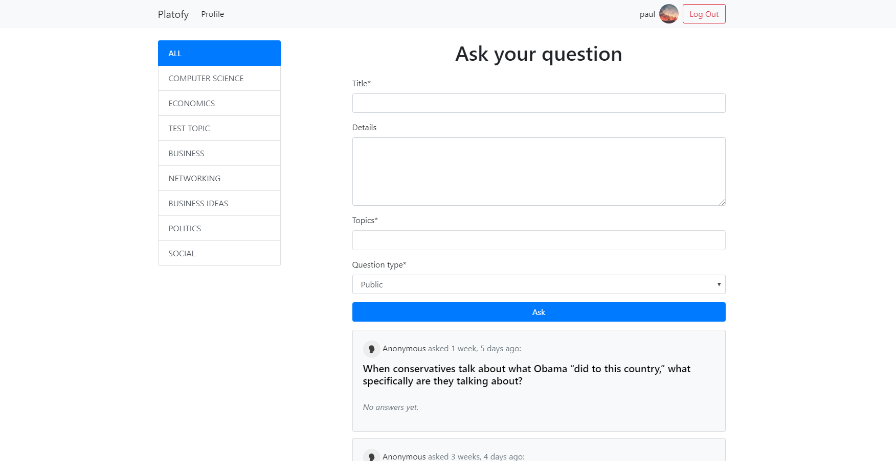

# Platofy
Platofy is a place on the internet where you can get answers for your questions and share your knowledge by answering other's people questions.  
You can ask any question and tag it accordingly, so people specialized in the specific topic can easily answer your question by filtering questions by topic.  
If you wish to ask a question without everybody knowing that YOU asked the question, you can set the question to be anonymous.



## Files

### requirements.txt
This text file includes a list with every necessay packet for Platofy.  
Run `pip3 install -r requirements.txt` to install all of them.

### .gitignore
It contains file paths of files and folders that don't neee to be commited.  
For instance, there is no point to commit the environment folder ("env", in this case).

### .travis.yml
It's a yml configuration file that has the purpose of allowing CI.

### qa/context_processor.py
The functions defined in this script will be callable in the Django templates.  
`top_topics` is a functions that returns the top `n` topics from the database based on the number of times the topic has been used.

### qa/forms.py
Every form on Platofy is made with the help of `forms.py` (i.e the login form, the question asking form)  
To render the question asking form to the page, you must import `AskQuestionForm` in `views.py` and give it as context.  

### qa/models.py
This file contains the `Answer`, `Question` and `Topic` modeles.

### qa/tests.py
The purpose of this file is to run a set of tests when the `python3 manage.py test` command is executed.  
In the `setUp` method, we define the variables that are needed for the tests.  
Some of the tests included in this script are:
- testing that the number of upvoters is correct after performing some upvotes
- testing that a question is valid (i.e it has at least 2 words)
- testing that the a 404 error is returned after a profile of a non-existent user was tried to be accessed

### qa/urls.py
The valid URLs live in this file. For example, `path('profile/<int:uid>/', views.profile, name='profile')` specifies that the user can access the path "profile/`the id of the user`/".

### qa/utils.py
This file has the purpose of storing helper functions. The helper function in `utils.py` is `question_format`, a function that takes the title of the question that the user submitted through the question asking form and returns a formatted version of the title. For example, the title `How tall   is Everest  ?  ` would become `How tall is Everest?`.

### qa/views.py
This Python script contains all the view functions. For example, a `GET` request to `/` will run the `index` function, which will render the homepage. On the other hand, a `POST` request will handle the question asking form. 

### qa/api/*
These files form the api.

### qa/templates/*
These are the templates of Platofy. Each template excluding `layout.html` is built on `layout.html`. `index.html` is the homepage, which contains the question asking form, the question [cards](https://getbootstrap.com/docs/4.4/components/card/) and a list with the top topics.

### static/css/style.scss
The code inside this SASS file is compiled to `style.css`, the CSS file that contains general styling.

### static/css/tagify.css
This is the styling for the question tags and it's part of the [Tagify](https://github.com/yairEO/tagify) library.

### static/js/scripts.js
This JS file includes AJAX requests, for instance
```javascript
$.post('/vote/', data_to_send, (resp) => {
    // If a html page (of the login page) was returned
    try {
        resp = JSON.parse(resp);
    } catch (e) {
        show_alert('You must me logged in to vote answers.');
        return;
    }
    const btns_cont = btn.parent();

    // Update the new number of points
    btns_cont.find('.points').text(resp.new_points);

    // Color/Uncolor the correct button
    btn.toggleClass('active_vote');
    btn.siblings('div').removeClass('active_vote');

    // Upvote animation
    if (vote_type === 'upvote' && btn.hasClass('active_vote')) {
        btn.addClass('upvoted');
    }
}
```
makes a `POST` request to `/vote/` and the user is added/removed from the upvoters/downvoters list.  
This script also has click events, for example
```javascript
$('#ask_your_question').click(() => {
    $('#ask_form').slideToggle();
    // Negate the value of 'open_ask_form'
    localStorage.setItem('open_ask_form', !JSON.parse(localStorage.getItem('open_ask_form')));
});
```
slides down/up the question asking form.

### static/js/tagify.min.js
This is the JS of the [Tagify](https://github.com/yairEO/tagify) library.